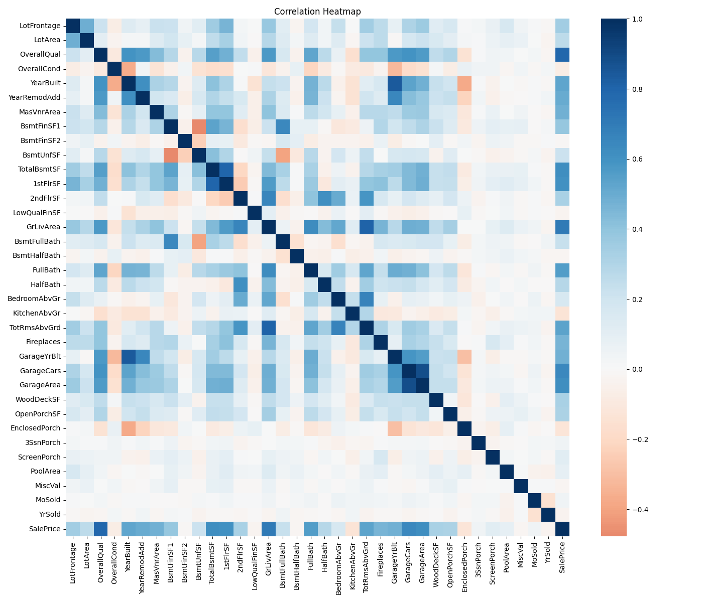
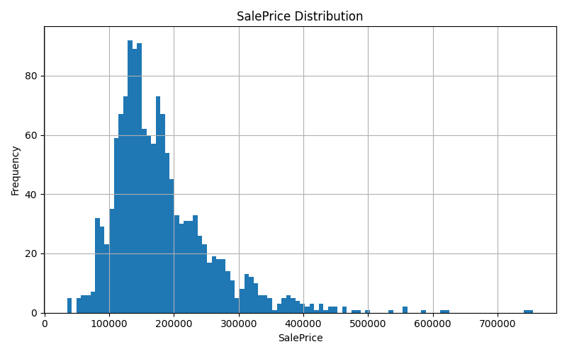
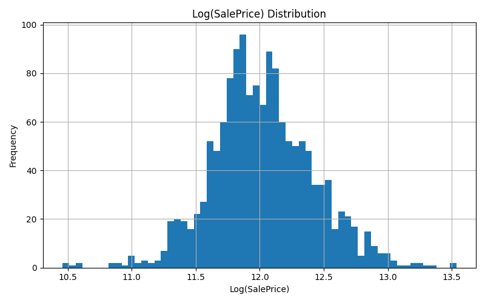
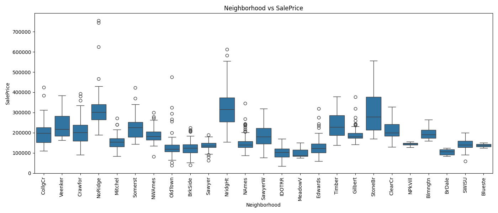

# 🏠 House Price Prediction with Advanced Feature Engineering & Ensemble Learning

## 🚀 Key Achievements

- Achieved ~0.119 RMSE using CatBoost
- Implemented advanced feature engineering with 100+ features
- Applied skewness correction for improved model stability
- Built ensemble model combining CatBoost, XGBoost, and LightGBM
- Generated multiple Kaggle-ready submission files

## 📌 Project Overview

This project aims to predict residential house prices in Ames, Iowa using advanced machine learning techniques.

Unlike standard implementations, this project combines advanced feature engineering, skewness correction, and ensemble learning strategies to achieve high predictive performance.

The main objective is to build a highly accurate regression model by combining:

- Advanced Feature Engineering
- Data Cleaning & Preprocessing
- Ensemble Learning Techniques
- Model Optimization

---

## 📊 Dataset

The dataset is based on the famous Kaggle competition:

**House Prices: Advanced Regression Techniques**

- 1460 training observations
- 1459 test observations
- 79 original features

---

## 🔍 Exploratory Data Analysis (EDA)

The following analyses were performed:

- Target distribution analysis
- Log transformation impact
- Correlation heatmap
- Feature importance relationships
- Neighborhood-based price analysis
- Missing value visualization

📈 Example visualizations:

---

## 🧠 Feature Engineering

A rich set of new features was created to improve model performance:

- Area-based features (total area, usable space)
- Ratio features (efficiency metrics)
- Interaction features (quality × area)
- Age-based features (house age, renovation age)
- Binary indicators (garage, pool, basement, etc.)
- Seasonal features (sale timing)

---

## ⚙️ Data Preprocessing

- Missing values handled using domain-based logic
- Outliers capped using quantile thresholds
- Rare categories grouped using Rare Encoding
- One-Hot Encoding applied
- Skewed numerical features transformed using log1p

---

## 🤖 Modeling

Multiple models were tested:

- Random Forest
- Gradient Boosting
- XGBoost
- LightGBM
- CatBoost

### 🔥 Best Model: CatBoost

CatBoost outperformed all other models due to its ability to handle categorical features effectively and capture complex nonlinear relationships.

- Achieved lowest RMSE
- Best generalization performance

---

## 🚀 Ensemble Learning

An advanced ensemble model was built using:

- CatBoost (primary model)
- XGBoost
- LightGBM

Weighted blending was applied to improve predictions.

---

## 📈 Model Performance

| Model              | RMSE (CV) |
|-------------------|----------|
| Random Forest     | ~0.138   |
| Gradient Boosting | ~0.125   |
| XGBoost           | ~0.135   |
| LightGBM          | ~0.131   |
| **CatBoost**      | **~0.119** |

---

## 📁 Outputs

The project generates:

- `submission_house_price_advanced.csv` → CatBoost predictions
- `submission_ensemble.csv` → Ensemble predictions
- Feature importance plot
- Multiple EDA visualizations

---

## 🏆 Key Insights

- Feature engineering significantly improved performance
- Quality × Area interaction was the most important feature
- Log transformation stabilized the target distribution
- Ensemble models provided additional robustness

---

## 🛠️ Technologies Used

- Python
- Pandas / NumPy
- Scikit-learn
- CatBoost
- LightGBM
- XGBoost
- Matplotlib / Seaborn

---

## 📌 Conclusion

This project demonstrates an end-to-end machine learning pipeline with a strong focus on:

- Data understanding
- Feature engineering
- Model optimization
- Ensemble learning

It is designed to be production-ready and easily extensible.

## 💡 Why This Project Stands Out

Unlike basic implementations, this project focuses on:

- Deep feature engineering
- Model comparison and optimization
- Ensemble learning strategies
- Production-ready pipeline structure

This makes it closer to real-world data science workflows rather than academic exercises.

## 📌 Project Highlights

- End-to-end machine learning pipeline
- Advanced feature engineering with domain-driven insights
- Model comparison and optimization
- Ensemble learning implementation
- Clean and reproducible project structure

---

## 👩‍💻 Author

Rabia Aşık
