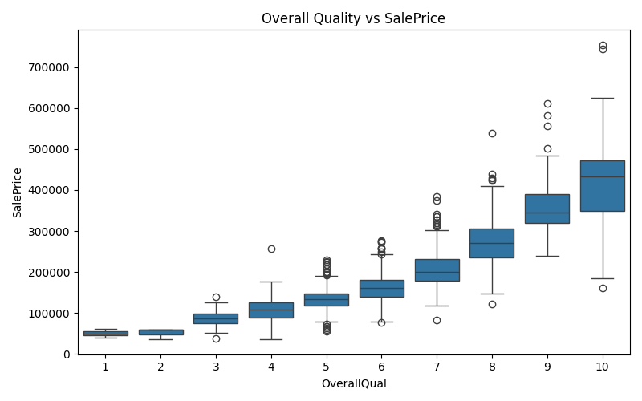
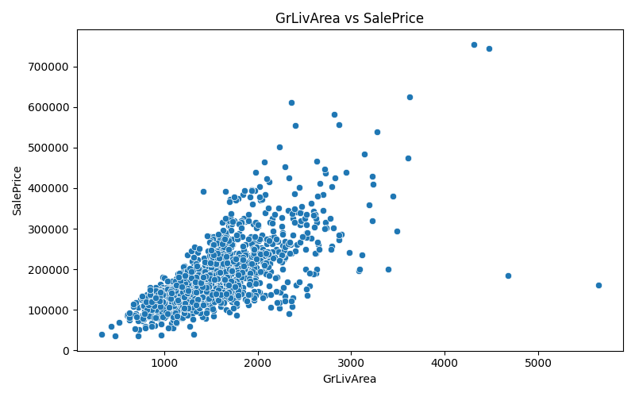
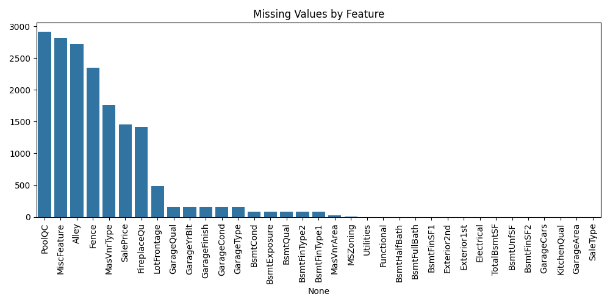

# 🏠 House Price Prediction

## 📌 Overview

In this project, I built an end-to-end machine learning pipeline to predict house prices using the Ames Housing dataset.

Instead of focusing only on model performance, I aimed to understand how data preprocessing, feature engineering, and model selection impact the final result.

---

## 🚀 Key Results

- RMSE: ~0.122 (CatBoost)  
- Kaggle Public Score: **0.12212**  
- Ensemble model provided slightly more stable predictions  

---

## 📊 Dataset

- 1460 training samples  
- 1459 test samples  
- 79 original features  

The dataset includes structural, quality, and location-based attributes of houses.

---

## 🔍 Exploratory Data Analysis

Before modeling, I analyzed the data to understand its structure and key relationships.

### Target Distribution

The target variable is right-skewed, which can negatively affect model performance.

---

### Log Transformation

Applying log transformation stabilizes variance and improves learning.

---

### Correlation Analysis

Features like OverallQual and GrLivArea show strong correlation with price.

---

### Neighborhood Effect

Location has a significant impact on house prices.

---

### Quality vs Price

Higher quality houses clearly have higher prices.

---

### Living Area vs Price

Living area has a strong linear relationship with price.

---

### Missing Values

Missing values are not random and require domain-based handling.

---

## 🧠 Feature Engineering

This was the most important part of the project.

I created new features to better represent the data:

- Total usable area  
- Quality × area interaction  
- House age & renovation age  
- Ratio-based features  
- Binary indicators (garage, basement, fireplace)

👉 The most important feature:
**Quality × Living Area**

---

## ⚙️ Data Preprocessing

- Missing values handled using domain knowledge  
- Outliers capped instead of removed  
- Rare categories grouped  
- Categorical variables encoded  
- Skewed numerical features transformed  

---

## 🤖 Modeling

I evaluated multiple models using cross-validation:

- Random Forest  
- Gradient Boosting  
- XGBoost  
- LightGBM  
- CatBoost  

CatBoost consistently gave the lowest error.

---

## 🧠 Why CatBoost?

CatBoost performed better because:

- It handles complex tabular relationships well  
- It is more robust to overfitting  
- It provides stable predictions across folds  

---

## 🚀 Ensemble Learning

I combined:

- CatBoost  
- LightGBM  
- XGBoost  

Using weighted averaging.

This slightly improved generalization performance.

---

## 📈 Model Performance

| Model              | RMSE |
|-------------------|------|
| Random Forest     | ~0.138 |
| Gradient Boosting | ~0.125 |
| XGBoost           | ~0.135 |
| LightGBM          | ~0.131 |
| CatBoost          | ~0.119 |

---

## 📁 Outputs

- `submission_house_price_advanced.csv`  
- `submission_ensemble.csv`  
- EDA visualizations  
- Feature importance analysis  

---

## 💡 Key Takeaways

- Feature engineering had the biggest impact  
- Data preprocessing directly affected performance  
- Ensemble methods provided small but consistent improvements  

---

## 🔗 Links

GitHub: https://github.com/rabia-ASIK/house-price-prediction  
Medium: https://medium.com/@rrabia.asik/beyond-baseline-designing-a-production-level-house-price-prediction-system-with-feature-0ce4f247aa78  
Kaggle: https://www.kaggle.com/rabiaas  

---

## 👩‍💻 Author

Rabia Aşık
